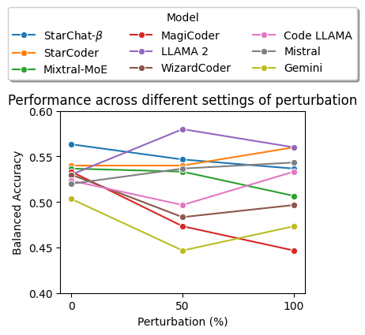
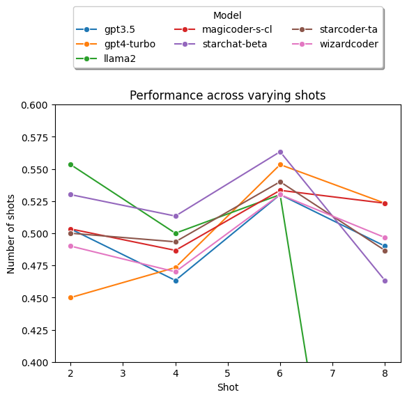
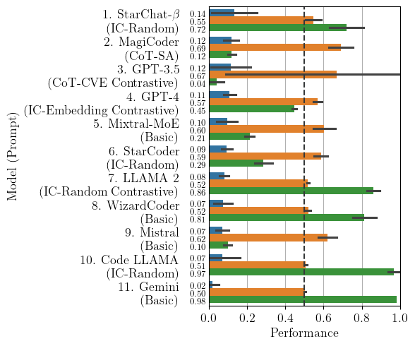
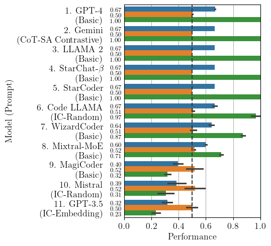

# LLM vulnerability detection study<!-- omit in toc -->

This webpage documents the results for extra experiments which we could not include in the paper due to the page limit.
Please see full data and code here: [https://figshare.com/s/78fe02e56e09ec49300b](https://figshare.com/s/78fe02e56e09ec49300b).

- [LLMs did not show signs of memorization (Section V. Discussions)](#llms-did-not-show-signs-of-memorization-section-v-discussions)
- [6-shots generally performed best (Section V. Discussions)](#6-shots-generally-performed-best-section-v-discussions)
- [MCC/F1 favored severely biased models (Section II. Study Setup)](#mccf1-favored-severely-biased-models-section-ii-study-setup)
  - [MCC](#mcc)
  - [F1](#f1)
- [Examples of our prompts (Section III-A. Prompting Methods)](#examples-of-our-prompts-section-iii-a-prompting-methods)
- [Implementation details (Section II. Study Setup)](#implementation-details-section-ii-study-setup)
- [Model survey (Section II. Study Setup)](#model-survey-section-ii-study-setup)
  - [Models we studied](#models-we-studied)
  - [Excluded models](#excluded-models)

## LLMs did not show signs of memorization (Section V. Discussions)

The below plot shows the performance of the best-performing prompt for each model, on the code which we refactored from the SVEN dataset.
The 50% setting applied 50% of the possible transformations, and 100% applied all the possible transformations.
We applied the semantic-preserving transformations from [NatGen](https://github.com/saikat107/NatGen): Var Renaming, Operand Swap, Block Swap and Loop Transformation.

## 6-shots generally performed best (Section V. Discussions)

This plot shows the performance of in-context prompts using different numbers of examples: 2, 4, 6, or 8 and keeping all other settings constant.
We tested all the models which performed best with prompts containing in-context examples (according to Fig. 3), using the best-performing prompt for each model.
The figure below shows that all LLMs except LLAMA 2 performed best with 6 shots. Therefore, we used 6 shots in our paper.
LLAMA 2 performed best with 2 shots and second-best with 6 shots.

## MCC/F1 favored severely biased models (Section II. Study Setup)

F1 score (harmonic mean of Precision and Recall) and MCC (Matthews Correlation Coefficient) are two metrics which are commonly used for evaluating classification models.
During our experiments, we found that they both tended to give high scores to severely imbalanced models (producing 90-100% of predictions on the same class, even though in our dataset the labels are balanced between the two classes).
TWe argue that these heavily biased models are less useful classifiers than those chosen with Balanced Accuracy, so we chose Balanced Accuracy to evaluate the models.

The cause might be the models' overall low performance - the baseline F1 score for an always-vulnerable classifier on a balanced dataset is 0.67, which is higher than the performance of other prompts. Because the models generally performed with scores lower than 0.67, the prompts/models which happened to severely bias towards "vulnerable" were ranked as the highest.

The following plots show the results for each metric.PredictVul is the proportion of examples which the model predicted vulnerable; PredictNonVul is the complement.

### MCC

MCC highly rewards a few models/prompts which are totally imbalanced (see MagiCoder, GPT-3.5, Mistral, Code LLAMA, Gemini), though not as badly as F1.

.

| Model            |   Seed |    MCC |   MPCAccuracy |   PredictVul |   PredictNonVul |
|:-----------------|-------:|-------:|--------------:|-------------:|----------------:|
| StarChat-$\beta$ |      0 | 0      |          0.5  |         0.62 |            0.38 |
| StarChat-$\beta$ |      1 | 0.1914 |          0.59 |         0.67 |            0.33 |
| StarChat-$\beta$ |      2 | 0.2144 |          0.6  |         0.68 |            0.32 |
| MagiCoder        |      2 | 0.1333 |          0.54 |         0.1  |            0.9  |
| MagiCoder        |      0 | 0.1474 |          0.54 |         0.08 |            0.92 |
| MagiCoder        |      1 | 0.0737 |          0.52 |         0.08 |            0.92 |
| GPT-3.5          |      0 | 0      |          0.5  |         0    |            1    |
| GPT-3.5          |      1 | 0.1429 |          0.52 |         0.02 |            0.98 |
| GPT-3.5          |      2 | 0.2041 |          0.54 |         0.04 |            0.96 |
| GPT-4            |      0 | 0.081  |          0.54 |         0.42 |            0.58 |
| GPT-4            |      1 | 0.145  |          0.57 |         0.37 |            0.63 |
| GPT-4            |      2 | 0.1025 |          0.55 |         0.39 |            0.61 |
| Mixtral-MoE      |      0 | 0.1562 |          0.56 |         0.18 |            0.82 |
| Mixtral-MoE      |      1 | 0.0799 |          0.53 |         0.17 |            0.83 |
| Mixtral-MoE      |      2 | 0.0521 |          0.52 |         0.18 |            0.82 |
| StarCoder        |      0 | 0.0966 |          0.54 |         0.22 |            0.78 |
| StarCoder        |      1 | 0.1228 |          0.55 |         0.21 |            0.79 |
| StarCoder        |      2 | 0.0649 |          0.53 |         0.31 |            0.69 |
| LLAMA 2          |      0 | 0.0892 |          0.53 |         0.87 |            0.13 |
| LLAMA 2          |      1 | 0.1    |          0.54 |         0.8  |            0.2  |
| LLAMA 2          |      2 | 0.0521 |          0.52 |         0.82 |            0.18 |
| WizardCoder      |      2 | 0.084  |          0.53 |         0.85 |            0.15 |
| WizardCoder      |      1 | 0.1155 |          0.55 |         0.75 |            0.25 |
| WizardCoder      |      0 | 0.0231 |          0.51 |         0.75 |            0.25 |
| Mistral          |      2 | 0.0737 |          0.52 |         0.08 |            0.92 |
| Mistral          |      1 | 0.0392 |          0.51 |         0.07 |            0.93 |
| Mistral          |      0 | 0.1048 |          0.53 |         0.09 |            0.91 |
| Code LLAMA       |      2 | 0.0392 |          0.51 |         0.93 |            0.07 |
| Code LLAMA       |      0 | 0      |          0.5  |         0.96 |            0.04 |
| Code LLAMA       |      1 | 0.1759 |          0.53 |         0.97 |            0.03 |
| Gemini           |      0 | 0.0586 |          0.51 |         0.97 |            0.03 |
| Gemini           |      1 | 0      |          0.5  |         0.98 |            0.02 |
| Gemini           |      2 | 0      |          0.5  |         0.98 |            0.02 |

### F1

F1 highly rewards some models/prompts which are totally imbalanced (see GPT-4, Gemini, LLAMA 2, StarChat-Beta, StarCoder Code LLAMA...).

.

| Model            |   Seed |     MCC |   MPCAccuracy |   PredictVul |   PredictNonVul |
|:-----------------|-------:|--------:|--------------:|-------------:|----------------:|
| GPT-4            |      0 |  0      |          0.5  |         1    |            0    |
| GPT-4            |      1 |  0      |          0.5  |         1    |            0    |
| GPT-4            |      2 |  0.1005 |          0.51 |         0.99 |            0.01 |
| Gemini           |      0 |  0      |          0.5  |         1    |            0    |
| Gemini           |      1 |  0      |          0.5  |         1    |            0    |
| Gemini           |      2 |  0      |          0.5  |         1    |            0    |
| LLAMA 2          |      0 |  0      |          0.5  |         1    |            0    |
| LLAMA 2          |      1 |  0      |          0.5  |         1    |            0    |
| LLAMA 2          |      2 |  0      |          0.5  |         1    |            0    |
| StarChat-$\beta$ |      0 |  0      |          0.5  |         1    |            0    |
| StarChat-$\beta$ |      1 |  0      |          0.5  |         1    |            0    |
| StarChat-$\beta$ |      2 |  0      |          0.5  |         1    |            0    |
| StarCoder        |      0 |  0      |          0.5  |         1    |            0    |
| StarCoder        |      1 |  0      |          0.5  |         1    |            0    |
| StarCoder        |      2 |  0      |          0.5  |         1    |            0    |
| Code LLAMA       |      0 |  0      |          0.5  |         0.96 |            0.04 |
| Code LLAMA       |      1 |  0.1759 |          0.53 |         0.97 |            0.03 |
| Code LLAMA       |      2 |  0.0392 |          0.51 |         0.93 |            0.07 |
| WizardCoder      |      0 |  0.1331 |          0.55 |         0.83 |            0.17 |
| WizardCoder      |      1 | -0.0667 |          0.48 |         0.9  |            0.1  |
| WizardCoder      |      2 |  0.028  |          0.51 |         0.85 |            0.15 |
| Mixtral-MoE      |      1 |  0.0649 |          0.53 |         0.69 |            0.31 |
| Mixtral-MoE      |      2 |  0.0429 |          0.52 |         0.68 |            0.32 |
| Mixtral-MoE      |      0 |  0.0436 |          0.52 |         0.7  |            0.3  |
| MagiCoder        |      0 |  0.0873 |          0.54 |         0.3  |            0.7  |
| MagiCoder        |      1 |  0.0436 |          0.52 |         0.3  |            0.7  |
| MagiCoder        |      2 | -0.0638 |          0.47 |         0.33 |            0.67 |
| Mistral          |      0 | -0.0676 |          0.47 |         0.27 |            0.73 |
| Mistral          |      1 |  0.1102 |          0.55 |         0.29 |            0.71 |
| Mistral          |      2 |  0.0429 |          0.52 |         0.32 |            0.68 |
| GPT-3.5          |      0 |  0.0238 |          0.51 |         0.23 |            0.77 |
| GPT-3.5          |      1 |  0.0231 |          0.51 |         0.25 |            0.75 |
| GPT-3.5          |      2 | -0.0483 |          0.48 |         0.22 |            0.78 |

## Examples of our prompts (Section III-A. Prompting Methods)

See examples of our prompts here: [Prompt examples](./Appendix.pdf)
<embed src="https://anonymous-llm-vulnerabilities.github.io/Appendix.pdf" type="application/pdf" />

## Implementation details (Section II. Study Setup)

These details were elided from the paper due to the page limit.

- StarCoder is the base model of StarChat-Beta; see https://huggingface.co/blog/starchat-alpha.
- We used the next-largest 13B version of LLAMA 2 because we lacked the resources to run the 70B version.
- Code LLAMA's example scripts set top_p to 0.9; see https://github.com/facebookresearch/codellama/blob/main/example_completion.py\#L15.
- OpenAI recommends to alter either temperature or top_p, but not both, for their models; see https://platform.openai.com/docs/api-reference/chat/create.

## Model survey (Section II. Study Setup)

The following is a table of models which we surveyed and reasons for exclusion.

### Models we studied

| Model                                          | Organization              | Parameters (Billion) | Fine-tuned for Instruction-following/chat?                                                    | Trained on code?                                                | Inference?                                   | Fine-tune?                                                                   | How to access?                                                                 |
|------------------------------------------------|---------------------------|----------------------|-----------------------------------------------------------------------------------------------|-----------------------------------------------------------------|----------------------------------------------|------------------------------------------------------------------------------|--------------------------------------------------------------------------------|
| GPT-4                                          | OpenAI                    | undisclosed          | Yes                                                                                           | Yes                                                             | Yes, API                                     | No                                                                           | OpenAI API                                                                     |
| GPT-3.5-turbo                                  | OpenAI                    | undisclosed          | Yes                                                                                           | Yes                                                             | Yes, API                                     | Yes https://platform.openai.com/docs/guides/fine-tuning                      | OpenAI API                                                                     |
| Llama 2                                        | Meta                      | 70B, 13B, 7B         | Yes                                                                                           | Yes                                                             | Yes, HF                                      | Yes, HF                                                                      | HF https://huggingface.co/meta-llama/Llama-2-70b-chat-hf                       |
| Code Llama                                     | Meta                      | 7B, 13B, 34B         | Yes                                                                                           | Yes                                                             | Yes, HF                                      | Yes, HF                                                                      | HF https://huggingface.co/codellama/CodeLlama-7b-hf                            |
| wizardcoder                                    | Microsoft                 | 15B                  | Yes                                                                                           | Yes                                                             | Yes, HF                                      | Yes, HF                                                                      | HF https://huggingface.co/WizardLM/WizardCoder-15B-V1.0                        |
| StarCoder                                      | HuggingFace Collaboration | 15.5B                | No (but demonstrates that it can be prompted to act as an assistant)                          | Yes                                                             | Yes, Huggingface                             | Yes, Github                                                                  | HF https://huggingface.co/bigcode/starcoder                                    |
| StarChat-Beta                                  | HuggingFace Collaboration | 15.5B                | Yes                                                                                           | Yes                                                             | Yes, HF                                      | Yes                                                                          | HF https://huggingface.co/HuggingFaceH4/starchat-beta                          |
| Mistral                                        | Mistral AI                | 7                    |                                                                                               |                                                                 |                                              |                                                                              |                                                                                |
| Mixtral                                        | Mistral AI                | 8x7B                 |                                                                                               |                                                                 |                                              |                                                                              |                                                                                |
| magicoder                                      | UIUC                      | 7                    |                                                                                               |                                                                 |                                              |                                                                              |                                                                                |
| Gemini                                         | Google                    |                      |                                                                                               |                                                                 |                                              |                                                                              |                                                                                |

### Excluded models

| Model                                          | Organization              | Parameters (Billion) | Fine-tuned for Instruction-following/chat?                                                    | Trained on code?                                                | Inference?                                   | Fine-tune?                                                                   | How to access?                                                                 | Exclusion rationale                |
|------------------------------------------------|---------------------------|----------------------|-----------------------------------------------------------------------------------------------|-----------------------------------------------------------------|----------------------------------------------|------------------------------------------------------------------------------|--------------------------------------------------------------------------------|------------------------------------|
| codegeex2                                      | Tsinghua University       | 6B                   | Yes                                                                                           | Yes                                                             | Yes, HF                                      | Yes, HF                                                                      | HF https://huggingface.co/THUDM/codegeex2-6b                                   | Not performing well                |
| chatglm2                                       | Tsinghua University       | undisclosed          | Yes                                                                                           | Yes? (not clearly stated but mentions added code training data) | Yes, HF                                      | Yes, HF                                                                      | HF https://huggingface.co/THUDM/chatglm2-6b                                    | Not performing well                |
| internlm-chat                                  | InternLM Team             | 7B                   | Yes                                                                                           | Yes                                                             | Yes, HF                                      | Yes, HF                                                                      | HF https://huggingface.co/internlm/internlm-chat-7b                            | Not performing well                |
| Falcon                                         | TII Abu Dhabi             | 40                   | Yes                                                                                           | No                                                              | Yes, HF                                      | Yes, HF                                                                      | HF https://huggingface.co/tiiuae/falcon-7b                                     | Not trained on code                |
| PaLM 2 https://developers.generativeai.google/ | Google                    |                      |                                                                                               |                                                                 |                                              |                                                                              |                                                                                | Subsumed by gemini                 |
| phi-1                                          | Microsoft                 | 1.3                  |                                                                                               |                                                                 |                                              |                                                                              |                                                                                | Doesn't follow instructions        |
| InstructCodeT5+                                | SalesForce                | 16                   |                                                                                               |                                                                 |                                              |                                                                              |                                                                                | Doesn't follow instructions        |
| grok                                           | X                         | 33                   |                                                                                               |                                                                 |                                              |                                                                              |                                                                                | API is in early access             |
| inflection-1                                   | Pi                        |                      |                                                                                               |                                                                 |                                              |                                                                              |                                                                                | Not available on API               |
| BLOOM                                          | HuggingFace Collaboration | 176B                 | Yes                                                                                           | Yes                                                             | Yes, Huggingface                             | No (too big)                                                                 | HF https://huggingface.co/bigscience/bloom                                     | Too big                            |
| SantaCoder                                     | HuggingFace Collaboration | 1.1B                 | No                                                                                            | Yes                                                             | Yes, Huggingface                             | Yes                                                                          | HF https://huggingface.co/bigcode/santacoder                                   | Subsumed by SantaCoder             |
| text-davinci-003                               | OpenAI                    | undisclosed          | No https://platform.openai.com/docs/model-index-for-researchers/models-referred-to-as-gpt-3-5 | Yes                                                             | Yes, API                                     | No                                                                           | OpenAI API                                                                     | Subsumed by gpt-3.5-turbo          |
| text-davinci-002                               | OpenAI                    | undisclosed          | No                                                                                            | Yes                                                             | Yes, API                                     | No                                                                           | OpenAI API                                                                     | Subsumed by gpt-3.5-turbo          |
| text-bison-001 (PaLM 2)                        | Google                    | undisclosed          | No                                                                                            | No                                                              | Yes, API                                     | Yes https://cloud.google.com/vertex-ai/docs/generative-ai/models/tune-models | Google Cloud API                                                               | Subsumed by gpt-3.5-turbo          |
| CodeGen                                        | SalesForce                | 16                   | Yes                                                                                           | Yes                                                             | Yes, HF                                      | Yes, HF                                                                      | HF https://huggingface.co/Salesforce/codegen2-16B                              | Not tuned for instructions         |
| chatglm                                        | Tsinghua University       | 6B                   | Yes                                                                                           | No                                                              | Yes, HF                                      | Yes, HF                                                                      | HF https://huggingface.co/THUDM/chatglm-6b                                     | Not tuned on code                  |
| wizardlm                                       | Microsoft                 | 30B, 13B             | Yes                                                                                           | Yes? (instruction distillation - not sure if it includes code)  | Yes, HF                                      | Yes, HF                                                                      | HF https://huggingface.co/WizardLM/WizardLM-70B-V1.0                           | Subsumed by WizardCoder            |
| koala                                          | UC Berkeley               | 13B                  | Yes                                                                                           | No                                                              | Yes, HF                                      | Yes, HF                                                                      | HF https://huggingface.co/young-geng/koala                                     | Not trained on code                |
| Bard                                           | Google                    | 137B                 |                                                                                               |                                                                 | No - browser only                            | No                                                                           |                                                                                | Not available                      |
| claude                                         | Anthropic                 | undisclosed          |                                                                                               |                                                                 | No - browser only, API waitlist seems closed |                                                                              | api                                                                            | Not available                      |
| claude-instant                                 | Anthropic                 | undisclosed          |                                                                                               |                                                                 | No - browser only, API waitlist seems closed |                                                                              | api                                                                            | Not available                      |
| OPT                                            | Meta                      | 175                  |                                                                                               |                                                                 | Yes, Huggingface                             | Yes, smaller version                                                         | Yes                                                                            | Not SOTA from this organization    |
| LLaMA                                          | Meta                      | 65                   |                                                                                               |                                                                 | Waitlist (but model weights were leaked 🙂)  | Yes, once we have the weights https://huggingface.co/blog/stackllama         | Waitlist                                                                       | Not SOTA from this organization    |
| Pythia                                         | EleutherAI                | 12B                  | No                                                                                            | No                                                              | Yes, Huggingface                             | Yes                                                                          | HF https://huggingface.co/EleutherAI/pythia-70m                                | Not trained on code                |
| GPT-J                                          | EleutherAI                | 6B                   | No                                                                                            | No                                                              | Yes, Huggingface                             | Yes                                                                          | HF https://huggingface.co/docs/transformers/model_doc/gptj                     | Not trained on code                |
| GPT-Neo                                        | EleutherAI                | 20B                  | No                                                                                            | No                                                              | Yes, Huggingface                             | Yes                                                                          | HF https://huggingface.co/docs/transformers/model_doc/gpt_neo                  | Not trained on code                |
| baichuan                                       | Baichuan Inc.             | 13B                  | Yes                                                                                           | No                                                              | Yes, HF                                      | Yes, HF                                                                      | HF https://huggingface.co/baichuan-inc/Baichuan-7B                             | Not trained on code                |
| dolly                                          | Databricks                | 12B                  | Yes                                                                                           | No                                                              | Yes, HF                                      | Yes, HF                                                                      | HF https://huggingface.co/databricks/dolly-v2-12b                              | Not trained on code                |
| oasst-sft-4                                    | LAION                     | 12B                  | Yes                                                                                           | No? (does not mention data besides instruction training data)   | Yes, HF                                      | Yes, HF                                                                      | HF https://huggingface.co/OpenAssistant/oasst-sft-4-pythia-12b-epoch-3.5       | Not trained on code                |
| openchat                                       | Tsinghua                  | 13B, 6B              | Yes                                                                                           | Yes? (instruction distillation - not sure if it includes code)  | Yes, HF                                      | Yes, HF                                                                      | HF https://huggingface.co/openchat/openchat                                    | Distilled from ChatGPT completions |
| vicuna                                         | LMSYS                     | 13B, 7B              | Yes                                                                                           | Yes? (instruction distillation - not sure if it includes code)  | Yes, HF                                      | Yes, HF                                                                      | HF https://github.com/lm-sys/FastChat/blob/main/docs/vicuna_weights_version.md | Distilled from ChatGPT completions |
